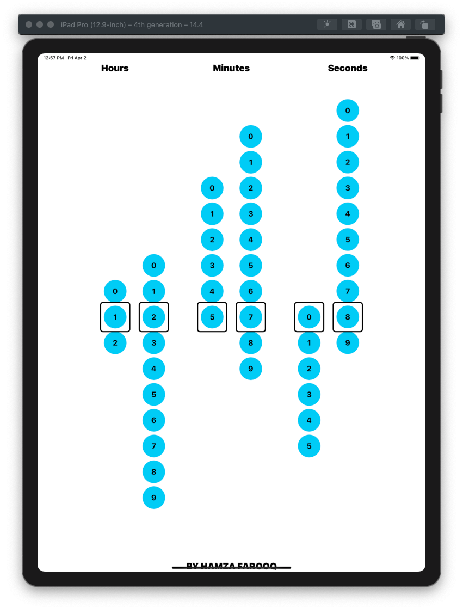

## Introduction

Hi, Humans!

My name is Hamza Farooq and I love 'Swift' programming. I always try to implement new ideas. Kindly share your thoughts on this one too.

# HFClock

Showing time in a unique way using swift programming language

### GIF View

### Image View

## Simple Usage

The main file contains only 125 lines of code so yeah this is pretty cool right... :D

## Example

Project files are attached. Simply download the project and see the magic happening. Currently the project only supports iPad.

## Contributions

Your contributions are most welcomed. Do let me know if you find any kind of issue while using this project. Please open an issue to discuss that problem. Thanks

## Auther

Hamza Farooq, hamza_faroooq@yahoo.com

## License

[MIT](https://github.com/hamza-faroooq/HFClock/blob/main/LICENSE) (Click Me O_o)
